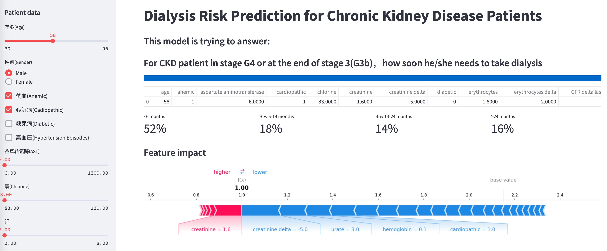

# Chronic Kidney Disease Dialysis Prediction

Libraries:  
  
* streamlit~=1.10.0
* pandas~=1.2.5
* numpy~=1.19.5
* matplotlib~=3.4.2
* shap~=0.40.0
* scikit-survival~=0.17.2
 
Run:

 1. Use Jupyter note book to generate your own models
 2. All models will be saved to pickle files
 3. use "streamlit run main.py" to run the webapp
